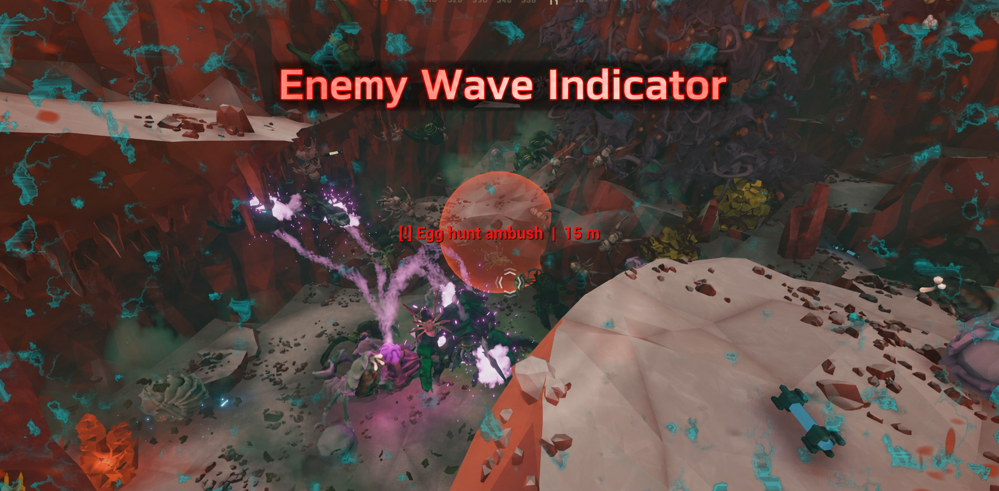
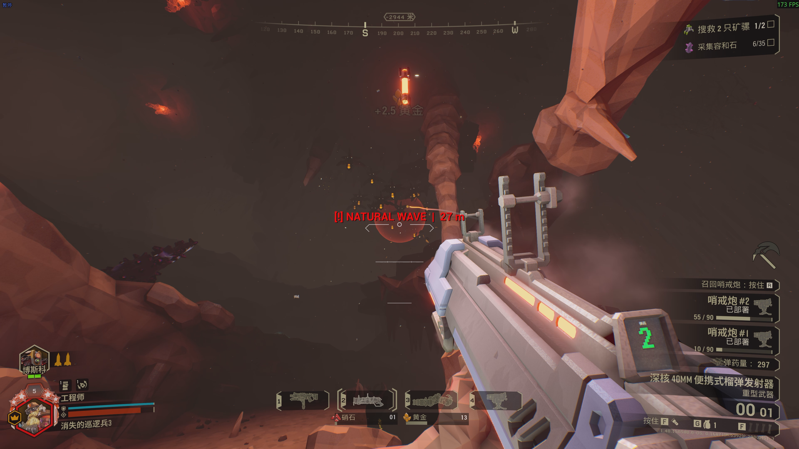
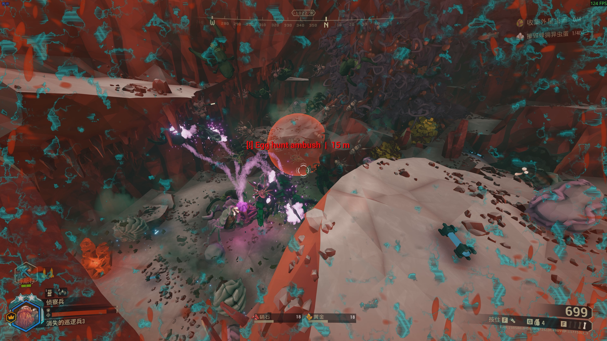
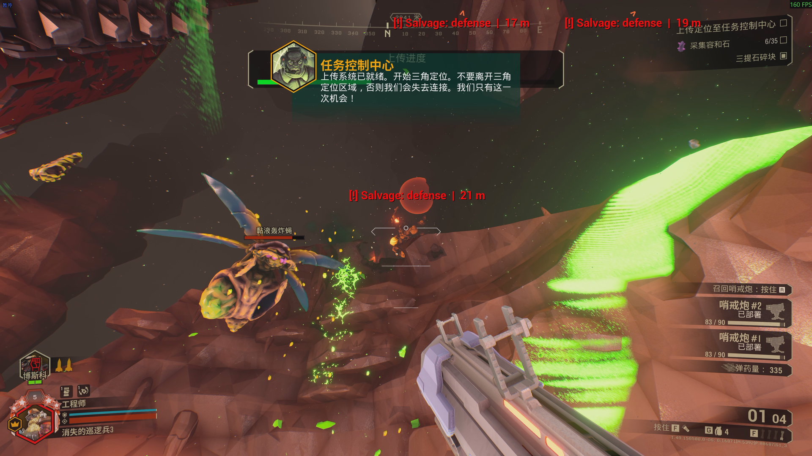
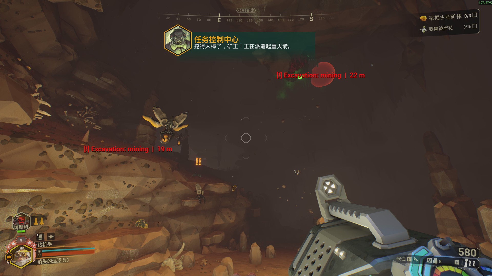
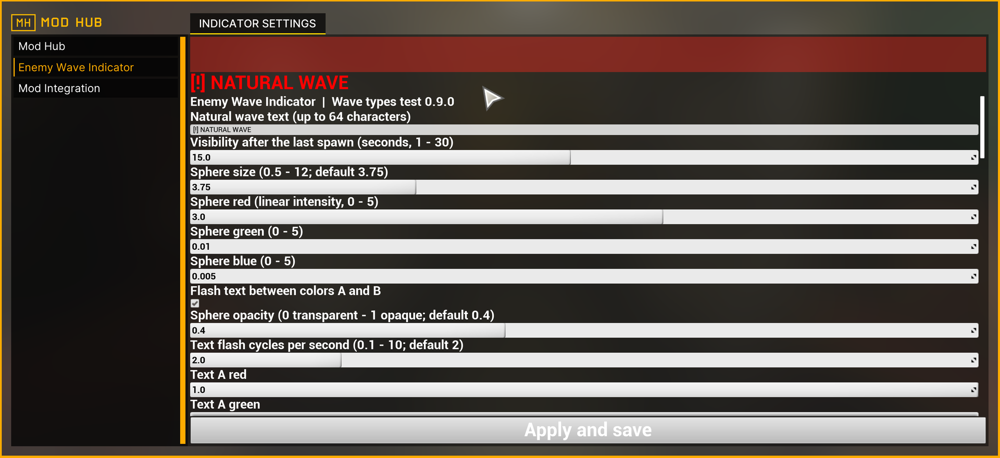

<!-- Player-facing overview, installation guide, configuration notes, and troubleshooting. -->
# Enemy Wave Indicator

[English](README.md) | [简体中文](README.zh-CN.md)

Enemy Wave Indicator marks detected enemy spawn areas with glowing spheres, customizable labels, and distance readouts. It supports natural waves and 35 stock scripted wave types in Deep Rock Galactic.

> This is a Windows public beta. The current build targets the Steam version of DRG 1.40 (tested build 24903151).

## Features

- Natural waves plus 35 scripted wave types, each with its own enable switch and label.
- Configurable sphere color, opacity, size, and display duration.
- Two alternating text colors with configurable flashing speed.
- Marker size scales with the number and base difficulty weight of spawned enemies.
- Up to eight spawn areas displayed at once.
- Host-to-client marker synchronization when every player has matching mod content.
- Read-only behavior: the mod observes spawning and does not change enemies, damage, rewards, or progression.

Only **Natural wave** is enabled by default. Open Mod Hub to enable other events, then select **Apply and save**. For example, mini-MULE ambushes use **Salvage: mini-MULE ambush**. See the [complete wave-type list](docs/WAVE-TYPES.md).

## Installation

Download the current package from [GitHub Releases](https://github.com/LostPatrol/EnemyWaveIndicator/releases/tag/v0.9.0-beta.1). The release archive contains both `main.dll` and `NormalWaveIndicator_P.pak`; the old internal filenames are retained for compatibility.

### Option A: MintCat (recommended)

1. Install [MintCat](https://github.com/iris-cat-dev/mintcat) and close DRG.
2. Subscribe to [Mod Hub](https://mod.io/g/drg/m/mod-hub) in mod.io.
3. In MintCat, import the downloaded Enemy Wave Indicator release ZIP as a local mod.
4. Enable Enemy Wave Indicator and Mod Hub, then select **Apply Changes / Save Changes** and wait for installation to finish.
5. Start DRG, wait about 40 seconds in the Space Rig, open Mod Hub, adjust the wave types you want, and select **Apply and save**.

MintCat installs the DLL and merges the Pak content it manages. Do not also copy the same Pak or DLL into the game folders manually.

### Option B: Manual installation

1. Close DRG and disable any MintCat installation of this mod.
2. Subscribe to and enable [Mod Hub](https://mod.io/g/drg/m/mod-hub) through DRG's in-game mod menu.
3. Download the compatible [UE4SSL 0.31.0 runtime](https://yuri-oss-hz.oss-cn-hangzhou.aliyuncs.com/releases/ue4ssl/windows/stable/0.31.0/UE4SSL.zip).
4. In Steam, open **Deep Rock Galactic → Manage → Browse local files**, then enter `FSD\Binaries\Win64`.
5. Extract the runtime into `Win64` while preserving its directory structure. `dwmapi.dll` and the `ue4ss` directory should both be directly inside `Win64`.
6. Open the Enemy Wave Indicator release ZIP and copy:
   - `main.dll` to `FSD\Binaries\Win64\ue4ss\mods\NormalWaveIndicator\main.dll`
   - `NormalWaveIndicator_P.pak` to `FSD\Content\Paks\NormalWaveIndicator_P.pak`
7. Start DRG, wait about 40 seconds in the Space Rig, then configure the mod in Mod Hub.

The DLL and Pak must come from the same release. When updating manually, replace both files. If another loader already owns `dwmapi.dll`, verify compatibility before replacing it.

## Gallery

| Egg Hunt ambush | Salvage defense |
|---|---|
|  |  |

| Excavation | Mod Hub settings |
|---|---|
|  |  |

## Troubleshooting

- **The mod is missing from Mod Hub:** confirm that Mod Hub is enabled, wait about 40 seconds in the Space Rig, and restart the game once.
- **Natural waves appear, but another event does not:** only natural waves are enabled by default. Enable the matching type in Mod Hub and select **Apply and save**.
- **Nothing appears:** verify that `main.dll` and `NormalWaveIndicator_P.pak` are from the same version. The host needs the DLL; clients need matching Pak content to render the custom markers.
- **MintCat reports a duplicate or loose Pak:** remove the manually installed `NormalWaveIndicator_P.pak` after confirming MintCat manages the mod, then apply changes again.
- **You are updating a very old manual installation:** remove or back up the old DLL and Pak before installing the current pair. Do not load two copies.

When reporting a problem, include the mission type, the wave/event that triggered it, whether you were host or client, your installation method, and any `probe-*.jsonl` file created beside the mod DLL.

## Current limitations

- Markers appear when supported enemies begin spawning; this is not advance wave prediction.
- New mod-defined controllers, some direct boss summons, and event-specific spawning paths may not be identified.
- Multiplayer synchronization and late joining have not completed full two-machine validation. The host needs the native DLL, and participating clients need matching content.
- The internal Pak path, save slot, DLL folder, and some code identifiers still use `NormalWaveIndicator` for compatibility.

## License

Source code is licensed under MIT. Distributed packages include the MinHook license. Deep Rock Galactic and its assets belong to Ghost Ship Games and their respective owners. This is an unofficial community mod.
