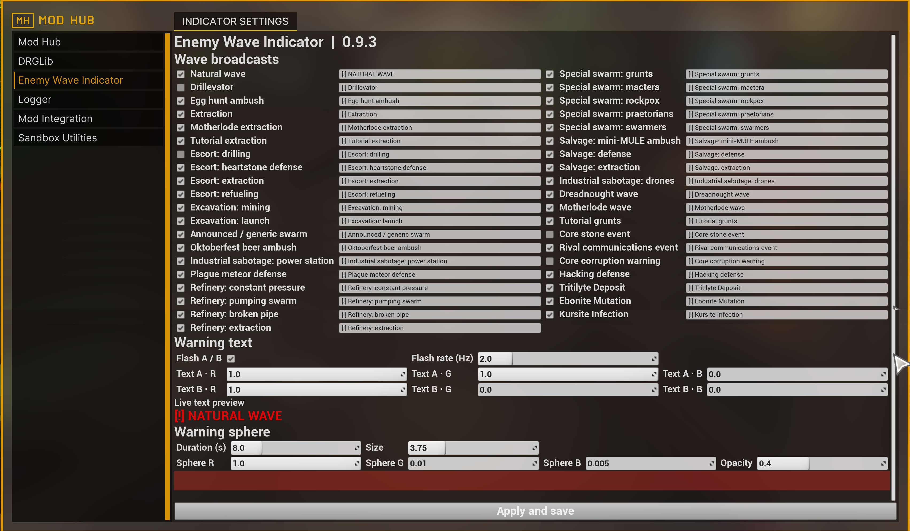

<!-- 面向玩家的中文项目介绍、安装教程、设置说明与故障排查。 -->
# Enemy Wave Indicator（敌潮指示器）

[English](README.md) | [简体中文](README.zh-CN.md)

Enemy Wave Indicator 会用发光球体、可自定义文字和距离信息，标出检测到的敌人生成区域。目前支持自然潮，以及 46 种游戏自带的脚本潮。

> 本项目目前是 Windows 公开测试版，适配 Steam 版 DRG 1.40（已测试游戏版本 build 24903151）。

## 功能

- 支持自然潮和 46 种脚本虫潮，每种类型都有独立的开关和提示文字；包括三提石矿藏、矿化爆发和氪石感染的直接事件刷怪。
- Mod Hub `Enemy Wave Indicator`；自带中英文两种语言
- 可设置球体颜色、透明度、大小和显示时长。
- 可设置两种交替文字颜色及闪烁速度。
- 标记大小会根据成功生成敌人的数量和基础难度权重变化。
- 最多同时显示 8 个生成区域。
- 所有玩家安装匹配版本内容时，可由房主向客机同步标记。
- 只读取游戏数据，不会修改刷潮逻辑。

默认开启全部虫潮播报，只有**深掘钻梯**、**执勤护送：钻进**、**核心岩事件**、**核心侵扰警告**和**幽魂不散**默认关闭。全部类型见[虫潮类型清单](docs/WAVE-TYPES.md)。

## 安装方法

### 1.使用 MintCat（推荐）

1. 安装 [MintCat](https://github.com/iris-cat-dev/mintcat)，并关闭游戏。
2. 在 MintCat 点击“添加mod”-“modio订阅”-“确定”
4. 在 MintCat 界面检查确定 Enemy Wave Indicator 和 Mod Hub 已启用。
5. 首次需从MintCat启动游戏并检查 Mod Hub 界面是否出现本mod的设置选项；后续可直接从Steam启动

MintCat 会安装 DLL，并把它管理的 Pak 内容合并到游戏中，不需要进行手动安装DLL等其他操作；

### 方式二：手动安装

1. 关闭游戏，并禁用 MintCat 中已安装的本 Mod，避免重复加载。
2. 通过游戏内 Mod 菜单订阅并启用 [Mod Hub](https://mod.io/g/drg/m/mod-hub)。
3. 下载兼容的 [UE4SSL 0.31.0 运行时](https://yuri-oss-hz.oss-cn-hangzhou.aliyuncs.com/releases/ue4ssl/windows/stable/0.31.0/UE4SSL.zip)。
4. 在 Steam 中打开 **Deep Rock Galactic → 管理 → 浏览本地文件**，进入 `FSD\Binaries\Win64`。
5. 把运行时按原目录结构解压到 `Win64`。完成后，`dwmapi.dll` 和 `ue4ss` 文件夹都应直接位于 `Win64` 下。
6. 打开 Enemy Wave Indicator 的 Release ZIP，复制：
   - `main.dll` 到 `FSD\Binaries\Win64\ue4ss\mods\EnemyWaveIndicator\main.dll`
   - `EnemyWaveIndicator_P.pak` 到 `FSD\Content\Paks\EnemyWaveIndicator_P.pak`
7. 启动游戏并进入空间站，待空间站完成加载后即可通过 Mod Hub 配置本 Mod。

手动更新时需要同时替换这两个文件。如果其他加载器已经安装了自己的 `dwmapi.dll`，请先确认兼容性再决定是否覆盖。

## 游戏截图

| 虫蛋收集伏击 | 矿骡修复防守 |
|---|---|
|  |  |
| 古脂矿体 | Mod Hub 设置 |
|  |  |

## 常见问题

- **Mod Hub 中没有出现本 Mod：**确认 Mod Hub 已启用，并确认空间站已经完成加载。
- **五种默认关闭的来源没有显示：**请在 Mod Hub 中开启对应类型，再点击**应用并保存**。
- **完全没有标记：**确认 `main.dll` 和 `EnemyWaveIndicator_P.pak` 来自同一版本。房主需要安装 DLL，客机需要匹配的 Pak 内容才能显示自定义标记。
- **MintCat 提示重复或松散 Pak：**先确认 MintCat 已管理本 Mod，再删除手动安装的 `EnemyWaveIndicator_P.pak`，然后重新应用更改。
- **从很早的手动安装版本升级：**先移走或备份旧 DLL 和 Pak，再安装当前版本，避免同时加载两份。

反馈问题时，请附上任务类型、触发问题的虫潮或事件、你是房主还是客机、安装方式，以及 Mod DLL 目录旁生成的 `probe-*.jsonl` 文件。

## 当前限制

- 标记会在受支持敌人开始生成时才出现。本 mod 当前不能预测虫潮出现地点。
- 新增 Mod 自定义控制器、部分直接生成的 Boss，以及少数事件自有的刷怪路径可能无法识别。

## 许可证

本项目源码使用 MIT 许可证。发布包中包含 MinHook 的许可证。Deep Rock Galactic 及其相关资产归 Ghost Ship Games 和各自权利人所有。本项目是非官方社区 Mod。
